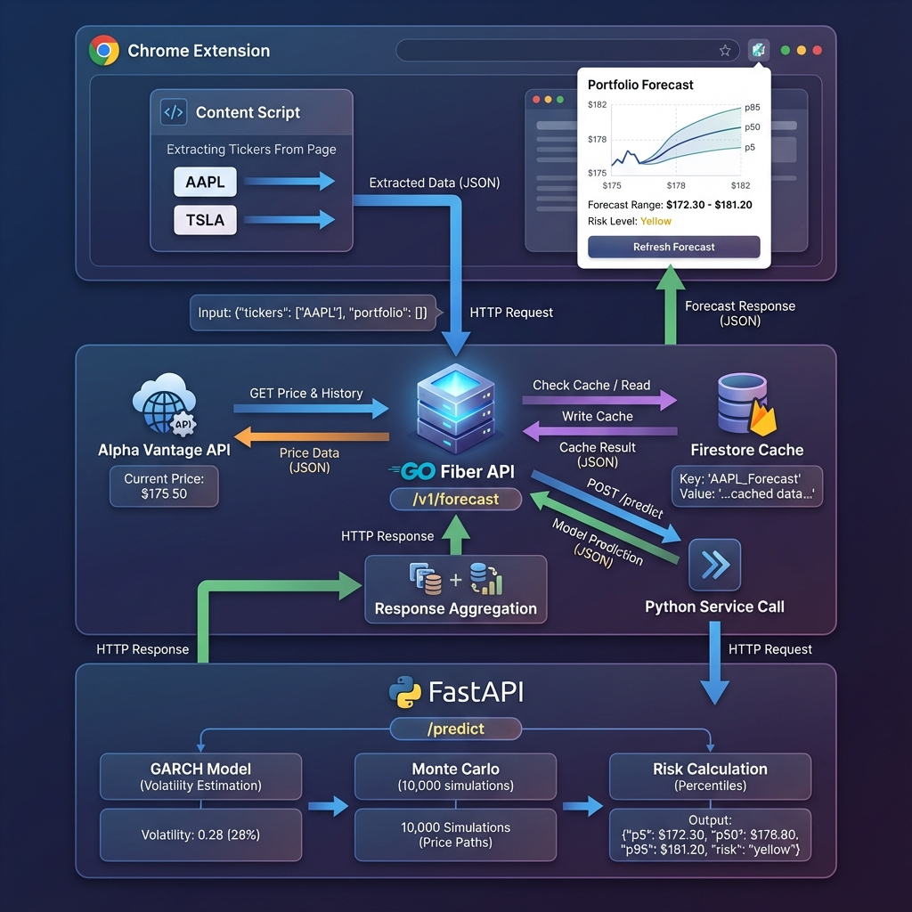

# PFC - Portfolio Forecast Chrome Extension

A real-time portfolio forecasting system that analyzes stock holdings and predicts 24-hour price movements using GARCH volatility modeling and Monte Carlo simulation. Built as a Chrome extension with a microservices architecture deployed on Google Cloud.
## ([Add To Chrome](https://chromewebstore.google.com/detail/fjekmggfnfjpilbgagjkalcmiobegjfe?utm_source=item-share-cb))
- GitHub repository for CI/CD))
- GitHub repository for CI/CD

##  Core Capabilities

- **Automated Detection**: Scans portfolio holdings on major brokerage sites (Robinhood, Webull, TD Ameritrade, E*TRADE, Fidelity, Charles Schwab)
- **Advanced Forecasting**: Generates 24-hour price predictions using GARCH(1,1) volatility estimation and 10,000-path Monte Carlo simulations
- **Risk Analysis**: Color-coded risk indicators (Green/Yellow/Red) based on volatility and downside exposure
- **Real-time Data**: Pulls current prices and 60-day historical data from Alpha Vantage API
- **Smart Caching**: Sub-200ms response times for cached forecasts with Firestore persistence

---

##  System Architecture



### Three-Tier Design

The system follows a microservices architecture with clear separation of concerns:

**1. Chrome Extension (Client Layer)**
- Content scripts inject into brokerage websites to extract ticker symbols and portfolio holdings via DOM traversal
- Popup UI displays interactive forecast charts using Chart.js
- Uses Chrome Storage API (backed by IndexedDB with LSM-Tree structure) for caching

**2. Go API Service (Orchestration Layer)**
- High-performance Fiber web server handling concurrent requests
- Orchestrates data fetching from Alpha Vantage API using goroutines
- Manages Firestore cache with B+ Tree indexing for O(log n) lookups
- Aggregates portfolio-level metrics from individual ticker forecasts
- **Data Structures**: Go maps (HashMaps), slices (dynamic arrays), channels (FIFO queues)

**3. Python Model Service (Computation Layer)**
- FastAPI server running GARCH and Monte Carlo models
- Uses NumPy's contiguous C arrays for vectorized numerical operations
- Applies Maximum Likelihood Estimation (MLE) for GARCH parameter fitting
- **Data Structures**: NumPy ndarrays (C arrays), Pydantic models, Python dicts (HashMaps)

---

## How Forecasting Works

### Example: Forecasting AAPL

**Starting State:**
- Current price: **$175.50** (from Alpha Vantage)
- Historical prices: 60 days of closing data
- Forecast horizon: 24 hours

### Step 1: GARCH Volatility Estimation

The system calculates log returns from historical prices:
```
returns = ln(price[t] / price[t-1])
Example: ln(174.50 / 173.20) = 0.0075 (0.75% return)
```

**GARCH(1,1) Model** estimates volatility using the formula:
```
σ²(t) = ω + α·ε²(t-1) + β·σ²(t-1)
```

Where:
- **ω** = Long-term average variance
- **α** = Weight on recent market shocks (surprise moves)
- **β** = Weight on past volatility (persistence)

The model uses **Maximum Likelihood Estimation (BFGS algorithm)** to find optimal parameters. For AAPL, this might yield:
- Daily volatility: 1.2%
- **Annualized volatility: 28%** (scaled by √252 trading days)

**Why GARCH?** Unlike simple standard deviation, GARCH adapts to market conditions. If last week was volatile, it predicts higher volatility today. If markets were calm, it adjusts downward.

### Step 2: Monte Carlo Simulation

Using the GARCH-estimated volatility, the system runs **10,000 parallel simulations** of possible price paths:

**Geometric Brownian Motion Formula:**
```
S(t) = S(0) × exp[(μ - 0.5σ²)·dt + σ·√dt·Z]
```

Where:
- **S(0)** = Current price ($175.50)
- **μ** = Drift (expected return)
- **σ** = Volatility from GARCH (28%)
- **Z** = Random shock from normal distribution

Each simulation generates a random market scenario:
```
Simulation #1: Z = +1.23 (lucky) → Final price: $182.87
Simulation #2: Z = -0.45 (unlucky) → Final price: $172.75
Simulation #8,543: Z = +0.12 → Final price: $176.42
... (10,000 total paths)
```

**Algorithm:** Mersenne Twister MT19937 for random number generation, Box-Muller transform for normal distribution.

### Step 3: Percentile Calculation

From 10,000 final prices, the system calculates risk percentiles using **Quickselect algorithm** (O(n) average):

```
p5  = $172.30  (5th percentile - 95% chance price stays above)
p50 = $176.80  (Median - most likely outcome)
p95 = $181.20  (95th percentile - 95% chance price stays below)
```

### Step 4: Risk Classification

```python
expected_return = (p50 - current_price) / current_price = 0.74%
downside_risk = (current_price - p5) / current_price = 1.82%
volatility = 28%

Risk Logic:
- Green: Low volatility (<5%) AND positive return (>2%)
- Red: High volatility (>10%) OR negative return (<-2%)
- Yellow: Moderate risk

Result for AAPL: RED (28% volatility exceeds threshold)
```

---

##  Tech Stack

### Languages & Frameworks
- **Frontend**: JavaScript (Chrome Extension APIs, Chart.js)
- **API Layer**: Go 1.21 (Fiber web framework)
- **ML Layer**: Python 3.11 (FastAPI, NumPy, Arch-GARCH)

### Data Structures & Algorithms
| Component | Data Structure | Algorithm | Complexity |
|-----------|----------------|-----------|------------|
| Ticker extraction | JavaScript Arrays | DOM traversal | O(n) |
| Cache storage | IndexedDB (LSM-Tree) | LevelDB backend | O(log n) writes |
| Go API maps | HashMap | Hash table with chaining | O(1) lookup |
| Concurrent fetching | Go Channels (FIFO) | CSP concurrency model | O(1) per message |
| Historical data | Go slices | Dynamic arrays | O(1) append |
| Price arrays | NumPy ndarray (C arrays) | Vectorized BLAS ops | O(n) |
| GARCH fitting | NumPy arrays | MLE with BFGS optimizer | O(n·k) iterations |
| Random generation | NumPy arrays | Mersenne Twister | O(n) |
| Monte Carlo | NumPy arrays | Vectorized GBM | O(m) paths |
| Percentiles | NumPy arrays | Quickselect | O(n) average |
| Firestore cache | B+ Tree index | Balanced tree | O(log n) lookup |

### Infrastructure
- **Cloud Platform**: Google Cloud Run (serverless containers)
- **Database**: Firestore (NoSQL document store)
- **API Service**: Alpha Vantage (market data)
- **CI/CD**: GitHub Actions
- **Container Registry**: Artifact Registry

---

## 📊 Performance Metrics

### Latency
- **Cache hit**: ~200ms (Firestore B+ Tree lookup + network)
- **Cache miss**: 5-7 seconds (Alpha Vantage API + GARCH + Monte Carlo)
- **GARCH fitting**: ~500ms per ticker (MLE convergence)
- **Monte Carlo**: ~800ms per ticker (10,000 vectorized simulations)

### Scalability
- **Max tickers per request**: 50 (Go validation limit)
- **Rate limiting**: 100 requests/minute per IP
- **Concurrent goroutines**: 2-50 (parallel market data fetching)
- **Python concurrency**: Single-threaded (NumPy uses BLAS multi-threading internally)

### Memory Efficiency
- **Per ticker forecast**: ~170 KB (60-day history + 10,000 simulations)
- **Peak memory (2 tickers)**: ~340 KB
- **NumPy arrays**: Contiguous C memory for cache efficiency

---

## Quick Start

### Prerequisites
- Google Cloud Project with Cloud Run enabled
- Alpha Vantage API key ([get free key](https://www.alphavantage.co/support/#api-key))
- GitHub repository for CI/CD

### Local Development

1. **Clone the repository**
   ```bash
   git clone https://github.com/yourusername/PFC.git
   cd PFC
   ```

2. **Run services locally**
   
   Python Model:
   ```bash
   cd python-model
   pip install -r requirements.txt
   uvicorn app.main:app --port 8000
   ```
   
   Go API:
   ```bash
   cd go-api
   export PYTHON_SERVICE_URL=http://localhost:8000
   export ALPHA_VANTAGE_KEY=your_key_here
   go run cmd/server/main.go
   ```

3. **Load Chrome Extension**
   - Open Chrome → `chrome://extensions/`
   - Enable "Developer mode"
   - Click "Load unpacked" → Select `chrome-extension/` folder

### Cloud Deployment

The project uses GitHub Actions for automated deployment. Pushing to `main` triggers:
1. Docker image builds for Go API and Python Model
2. Artifact Registry push
3. Cloud Run deployment with environment variables

See [`docs/DEPLOYMENT.md`](docs/DEPLOYMENT.md) for detailed configuration.

---

## Chrome Web Store Packaging

Generate a Web Store-ready ZIP:
```bash
./infrastructure/scripts/package-extension.sh
```

The script creates `pfc-extension-v{version}.zip` with:
- Manifest V3 compliance
- Properly sized icons (16×16, 48×48, 128×128)
- Minified assets

---

## 🔍 Project Structure

```
PFC/
├── chrome-extension/       # Client-side extension
│   ├── content/           # DOM extraction scripts
│   ├── popup/             # UI and Chart.js visualization
│   └── manifest.json      # Extension metadata
├── go-api/                # Orchestration service
│   ├── cmd/server/        # Main entry point
│   ├── internal/
│   │   ├── handlers/      # HTTP route handlers
│   │   ├── services/      # Business logic (orchestrator, cache, market data)
│   │   └── models/        # Go structs and types
│   └── Dockerfile
├── python-model/          # ML forecasting service
│   ├── app/
│   │   ├── models/        # GARCH and Monte Carlo implementations
│   │   ├── services/      # Forecast orchestration
│   │   └── schemas/       # Pydantic models
│   └── requirements.txt
├── infrastructure/        # Deployment automation
│   └── scripts/
├── docs/
│   ├── DEPLOYMENT.md      # Full deployment guide
│   └── DRY_RUN_EXAMPLE.md # Technical deep dive with calculations
└── .github/workflows/     # CI/CD pipelines
```

---

## Technical Highlights

### Why This Architecture?

**Go for Orchestration:**
- Goroutines enable concurrent API calls (fetching AAPL and TSLA in parallel)
- Low memory footprint (512MB Cloud Run instance handles 100+ req/min)
- Fiber framework provides <1ms routing latency

**Python for Modeling:**
- NumPy's C-based arrays are 100x faster than pure Python for numerical ops
- GARCH library (Arch) provides battle-tested MLE implementations
- Vectorized operations leverage CPU SIMD instructions

**Firestore for Caching:**
- B+ Tree indexing provides O(log n) lookups vs O(n) for scanning
- TTL-based expiration (1-hour cache) balances freshness and API cost
- Global distribution reduces latency for worldwide users

### Key Design Decisions

1. **10,000 Monte Carlo Paths**: Statistical stability (percentiles within ±$0.10) without excessive computation
2. **60-Day Historical Window**: Sufficient data for GARCH convergence while staying responsive to recent market shifts
3. **24-Hour Forecast**: Short horizon reduces uncertainty and improves accuracy
4. **Cache Key Hashing (MD5)**: Deterministic cache hits regardless of ticker order (sorted before hashing)

---

## License

MIT License - See [LICENSE](LICENSE) for details.

---

## Contributing

Contributions welcome! Areas for improvement:
- Add support for options/crypto forecasting
- Implement WebSocket streaming for real-time updates
- Expand risk metrics (Value at Risk, Sharpe ratio)
- Add backtesting framework to validate model accuracy

---

**Built with modern financial engineering principles and cloud-native architecture.**
